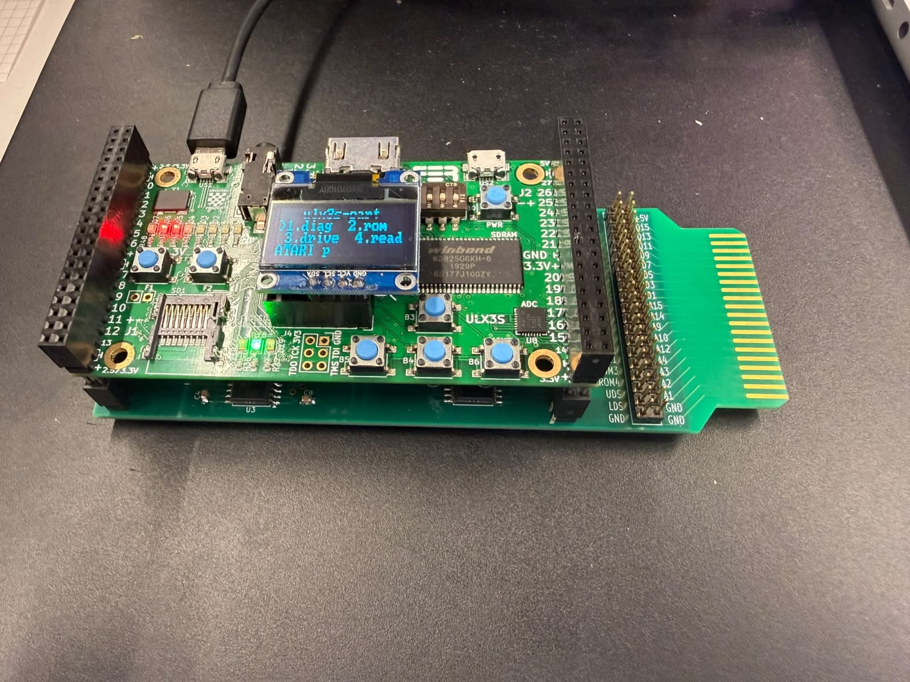
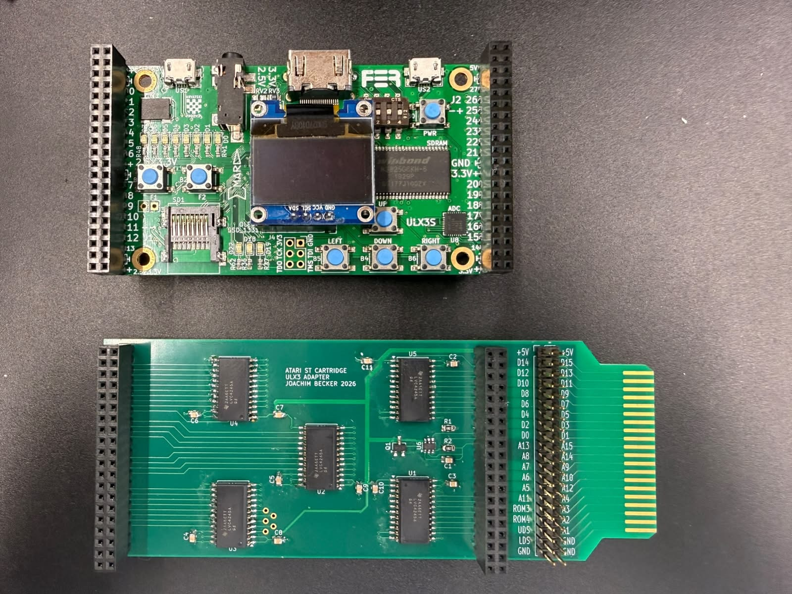
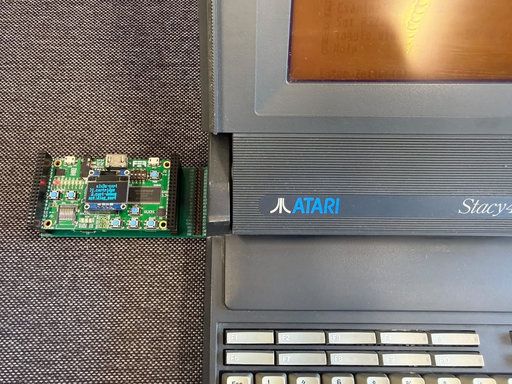
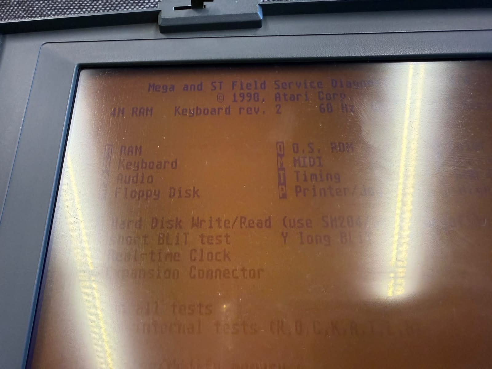

Atari-FPCartridge
=================

**Atari Field Programmable Cartridge**

Use an ULX3S FPGA to emulate an Atari ST cartridge.

Overview
--------

Atari-FPCartridge is a proof-of-concept adapter and FPGA design that connects a
ULX3S board to the Atari ST cartridge port. The goal is to make cartridge
development, boot analysis, ROM emulation, and hardware experimentation much
easier without building a custom FPGA board from scratch on day one.

The project combines:

-   a KiCad adapter PCB for the Atari ST cartridge connector and the ULX3S
    headers

-   level shifting between the 5 V Atari bus and the 3.3 V FPGA I/O

-   power-path selection between Atari 5 V and ULX3S USB 5 V

-   FPGA firmware for cartridge emulation, diagnostics, display output, and
    bus-oriented test modes

The result is a practical development platform for exploring what the Atari ST
expects at the cartridge port and for gradually moving toward more advanced
cartridge behavior.

Why ULX3S + FPGA
----------------

An FPGA is a good fit for this job because the Atari cartridge port is
fundamentally a parallel hardware interface. An FPGA can react
deterministically, observe many signals at once, and eventually emulate ROM
behavior with cycle-level control.

Compared with a Raspberry Pi or similar SBC:

-   **Advantages of the FPGA approach**

    -   deterministic timing

    -   direct parallel I/O handling

    -   much better fit for ROM emulation and bus experiments

    -   easier path toward cycle-precise cartridge behavior

-   **Disadvantages of the FPGA approach**

    -   HDL development is maybe more complex than software on Linux

    -   higher entry barrier for tooling and synthesis. I’m a hardware designer
        by trade, so it is my natural way of doing thing ;-)

    -   FPGAs are less common and potentially higher cost than e.g. RPI

-   **Advantages of an SBC approach**

    -   easier software stack

    -   networking, file systems, and UI are simpler

    -   fast prototyping for higher-level features

-   **Disadvantages of an SBC approach**

    -   GPIO timing is much less deterministic and has to be tweaked by RPI
        GPIOs

    -   parallel bus interfacing is harder

    -   extra hardware is usually needed to make the interface robust

The ULX3S offers a strong middle ground: a real FPGA, a convenient dev board,
USB programming, built-in buttons, LEDs, OLED support, HDMI video, and future
expansion options such as Wi-Fi-assisted workflows.

A note on SidecarTridge
-----------------------

This project is inspired by the excellent
[SidecarTridge](https://sidecartridge.com/) project. SidecarTridge shows how
much can be achieved when modern programmable logic and the Atari ST cartridge
port are combined thoughtfully. Atari-FPCartridge is not trying to diminish that
work. On the contrary, it is a respectful proof of concept built in the same
spirit: use todays hardware to tweak your old retro Atari and have fun as in the
golden days.  

Hardware
--------

### PCB scope

The adapter PCB is designed to sit between the Atari ST cartridge connector and
the ULX3S board. It provides:

-   Atari cartridge connector breakout

-   ULX3S header connections

-   bidirectional level shifters for the data bus

-   shifted input paths for address and control signals

-   power-path selection between USB power and Atari cartridge power

### Power

The board is intended to support powering the setup from either:

-   **ULX3S USB 5 V**

-   **Atari ST cartridge-port 5 V**

The power section is built around automatic source selection so that:

-   when USB power is present, the ULX3S can power itself and the level shifters
    locally

-   when USB power is absent, the adapter can be powered from the Atari
    cartridge port

This avoids a manual source switch in normal use and keeps the adapter much
easier to operate during development and bring-up.

### Signals

#### Unidirectional signals into the FPGA

These lines are treated as bus-observation inputs from the Atari side:

-   `A1..A15`

-   `ROM3#`

-   `ROM4#`

-   `UDS#`

-   `LDS#`

#### Bidirectional signals

These lines are routed through bidirectional level shifters:

-   `D0..D15`

They can be:

-   read by the FPGA during analysis and test modes

-   driven by the FPGA during cartridge emulation

-   driven selectively in debug output tests

#### FPGA-controlled transceiver signals

The level shifters expose separate control to the FPGA for:

-   `DIR4`

-   `OE4`

-   `DIR5`

-   `OE5`

That keeps the hardware flexible and allows different modes to switch between
safe sniffing, drive tests, and cartridge emulation behavior.

Repository structure
--------------------

-   `kicad/` - schematic, PCB, symbols, footprints

-   `stacy-cart-menu/` - FPGA design, constraints, ROM build flow

Operating modes
---------------

The FPGA project includes a menu on the OLED and several operating modes.

### `diag_cart`

This is the default power-up mode. It presents an Atari ST diagnostic cartridge
ROM image at the cartridge port so the machine can boot directly into the
diagnostic cartridge.

### `boot_analyzer`

This mode is intended to analyze the cartridge boot process and show how far the
system gets. It uses the OLED and the front-panel LEDs to indicate progress.

The LEDs are used as a step display:

-   a LED stays on when a step has been reached

-   a LED blinks slowly while the analyzer is waiting

-   a LED blinks quickly when a step times out or fails

This is useful for checking whether the expected cartridge accesses occur during
boot and whether the machine reaches the expected execution sequence.

### `beep`

This mode uses a small custom cartridge program that was created with AI
assistance and then integrated as a dedicated 68000-side test image. It
demonstrates that the FPGA can present a custom cartridge ROM and make the Atari
execute user-provided code.

In practical terms, it is a very small proof that the design can go beyond
passive observation and actively influence software execution through cartridge
ROM emulation. It makes the speaker beep to see whether the CPU is alive before
even accessing RAM or keyboard.

### `cart-debug`

The debug submenu contains low-level hardware test modes for board bring-up and
signal verification.  It is useful for pin verification and confirming that the
board routing matches the expected net mapping.

#### `drive`

This mode selects one signal at a time (selectable by buttons and OLED menu) and
toggles it at a visible rate so it can be checked with a multimeter or scope.
GP19 acts as read input any one can connect one output after another to the
input and see whether it is toggeling.

#### `read`

This mode is the opposite and lets the FPGA read external signal levels and show
them on the OLED. GP19 is enabled as 1Hz toggeling pin such that just with a
single cable on is capable of checking all solder connections and pins of the
board.  

OLED and LED diagnostics
------------------------

The OLED is used as the primary local UI. It shows:

-   the top-level menu

-   the currently selected cartridge mode

-   the current debug mode

-   analyzer state and captured addresses

The LEDs provide a quick visual status summary without needing to read the
display closely. This is especially useful while powering the Atari on, when
watching both the computer and the adapter at the same time.  
  
The Board also has a HDMI output which could be leveraged in future.  

Building and flashing
---------------------

~~~~~~~~~~~~~~~~~~~~~~~~~~~~~~~~~~~~~~~~~~~~~~~~~~~~~~~~~~~~~~~~~~~~~~~~~~~~~~~~
To build and program the FPGA design, the following tools are required:

- [oss-cad-suite](https://github.com/YosysHQ/oss-cad-suite-build) including:
  - `yosys`
  - `nextpnr-ecp5`
  - `ecppack`
  - `openFPGALoader`
- `python3`
- `make`

This project was developed with the ULX3S toolchain from `oss-cad-suite`.
~~~~~~~~~~~~~~~~~~~~~~~~~~~~~~~~~~~~~~~~~~~~~~~~~~~~~~~~~~~~~~~~~~~~~~~~~~~~~~~~

 

The FPGA project lives in `stacy-cart-menu/`.

### Build

~~~~~~~~~~~~~~~~~~~~~~~~~~~~~~~~~~~~~~~~~~~~~~~~~~~~~~~~~~~~~~~~~~~~~~~~~~~~~ sh
cd stacy-cart-menu
make build
~~~~~~~~~~~~~~~~~~~~~~~~~~~~~~~~~~~~~~~~~~~~~~~~~~~~~~~~~~~~~~~~~~~~~~~~~~~~~~~~

### Program SRAM

~~~~~~~~~~~~~~~~~~~~~~~~~~~~~~~~~~~~~~~~~~~~~~~~~~~~~~~~~~~~~~~~~~~~~~~~~~~~~ sh
make prog
~~~~~~~~~~~~~~~~~~~~~~~~~~~~~~~~~~~~~~~~~~~~~~~~~~~~~~~~~~~~~~~~~~~~~~~~~~~~~~~~

On some macOS setups, direct USB access to `openFPGALoader` may require `sudo`:

~~~~~~~~~~~~~~~~~~~~~~~~~~~~~~~~~~~~~~~~~~~~~~~~~~~~~~~~~~~~~~~~~~~~~~~~~~~~~ sh
sudo make prog
~~~~~~~~~~~~~~~~~~~~~~~~~~~~~~~~~~~~~~~~~~~~~~~~~~~~~~~~~~~~~~~~~~~~~~~~~~~~~~~~

### Flash configuration memory

~~~~~~~~~~~~~~~~~~~~~~~~~~~~~~~~~~~~~~~~~~~~~~~~~~~~~~~~~~~~~~~~~~~~~~~~~~~~~ sh
make flash
~~~~~~~~~~~~~~~~~~~~~~~~~~~~~~~~~~~~~~~~~~~~~~~~~~~~~~~~~~~~~~~~~~~~~~~~~~~~~~~~

If needed:

~~~~~~~~~~~~~~~~~~~~~~~~~~~~~~~~~~~~~~~~~~~~~~~~~~~~~~~~~~~~~~~~~~~~~~~~~~~~~ sh
sudo make flash
~~~~~~~~~~~~~~~~~~~~~~~~~~~~~~~~~~~~~~~~~~~~~~~~~~~~~~~~~~~~~~~~~~~~~~~~~~~~~~~~

### Detect the board

~~~~~~~~~~~~~~~~~~~~~~~~~~~~~~~~~~~~~~~~~~~~~~~~~~~~~~~~~~~~~~~~~~~~~~~~~~~~~ sh
make detect
~~~~~~~~~~~~~~~~~~~~~~~~~~~~~~~~~~~~~~~~~~~~~~~~~~~~~~~~~~~~~~~~~~~~~~~~~~~~~~~~

or:

~~~~~~~~~~~~~~~~~~~~~~~~~~~~~~~~~~~~~~~~~~~~~~~~~~~~~~~~~~~~~~~~~~~~~~~~~~~~~ sh
sudo make detect
~~~~~~~~~~~~~~~~~~~~~~~~~~~~~~~~~~~~~~~~~~~~~~~~~~~~~~~~~~~~~~~~~~~~~~~~~~~~~~~~

 ROM content
---------------

The current setup demonstrates two distinct cartridge content styles:

-   a real diagnostic cartridge ROM image

-   a small custom cartridge program for the beep mode

The beep cartridge is particularly important because it proves that this
platform is not limited to replaying an existing ROM dump. It can also expose
newly created cartridge software and use that to control the Atari from the
cartridge side.

 What this enables
---------------------

Even in its current proof-of-concept form, the project already points toward a
much larger set of possibilities:

-   loading arbitrary cartridge images into FPGA-backed ROM

-   testing new custom Atari ST cartridge software

-   observing cartridge-port activity during boot and diagnostics

-   building more advanced debug and development tools

-   using the ULX3S platform as a fast iteration environment before designing a
    dedicated board

With more work, this platform could also grow toward network-assisted workflows
using the ULX3S ecosystem, including Wi-Fi-enabled cartridge management and
other higher-level features in the spirit of
[SidecarTridge](https://sidecartridge.com/). More broadly, it suggests a path
toward many of the capabilities demonstrated by SidecarTridge, while staying
focused here on a compact and understandable FPGA-first proof of concept.

 Outlook
-----------

This project is intentionally a proof of concept. The current adapter uses a
full ULX3S development board because that makes experimentation fast and
practical.

If there is enough interest, the next logical step would be a much smaller
dedicated cartridge board that integrates only:

-   the FPGA

-   the level shifters

-   the power-path logic

-   the cartridge interface

That would reduce size, cost, and assembly complexity while preserving the
lessons learned from this development platform.

  
But guys, imagine how blown away I was when my STacy first bootet from a debug
cartridge I loaded into “my” FPGA and that it was possible to ask AI to
“generate a 68000 binary that beeps the speaker” is actually working 🤩🤩🤩 You
can use this to create your own code and load it on your Atari.  
  

